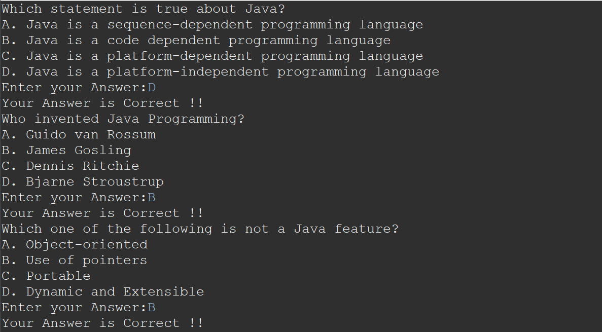

# Simple Quiz Application



## Overview

This Java-based Quiz Application is designed to provide users with an interactive quiz experience. Users can attempt a series of questions and receive immediate feedback on their answers. The application ensures a user-friendly quiz-taking process and provides correct answers if the marked answer is wrong.

## Functionality

### 1. Question Asking

- The application presents a series of questions to the user.
- Each question is displayed one at a time to the user.

### 2. Answering Questions

- Users choose their answers from the provided options.
- The application accepts and validates user input.

### 3. Feedback on Answers

- After submitting an answer, the application provides immediate feedback.
- If the answer is correct, the user is congratulated and can proceed to the next question.
- If the answer is incorrect, the correct answer is displayed, and the user can learn from the mistake.

### 4. Scoring

- The application keeps track of the user's score based on correct and incorrect answers.
- Users can view their overall score at the end of the quiz.

## How it Works

1. **Start Quiz:**
   - Users initiate the quiz and are presented with the first question.

2. **Answering Questions:**
   - Users choose or input their answers.

3. **Immediate Feedback:**
   - The application provides instant feedback on each answer.

4. **Score Tracking:**
   - The application keeps track of the user's score throughout the quiz.

5. **Correcting Mistakes:**
   - If an answer is incorrect, the correct answer is displayed.

6. **End of Quiz:**
   - Users receive their final score and can review their answers.

## Usage Example

```java
//Printing Questions and their Options
for(Map.Entry<Questions,Character> map: hmap.entrySet()) {

System.out.println(map.getKey().getQuestions());
System.out.println(map.getKey().getOption1());
System.out.println(map.getKey().getOption2());
System.out.println(map.getKey().getOption3());
System.out.println(map.getKey().getOption4());
				
System.out.print("Enter your Answer:");
Character answer = sc.next().charAt(0);
				
int check = Character.compare(answer,map.getValue());
				
if(check ==0) {
		System.out.println("Your Answer is Correct !!");
		correctAnswer++;
	}
else
		System.out.println("Wrong Answer!!!");
	}
System.out.println();
System.out.println("**********Result**********");
System.out.println("Total Questions Attempted: "+hmap.size());
System.out.println("You scored " + correctAnswer+"/5");
System.out.println("Percentage: "+ (correctAnswer*100)/hmap.size()+"%");
			
double calcPercentage = (correctAnswer*100)/hmap.size();
if(calcPercentage<35)
	System.out.println("Poor Performance!!!");
else if(calcPercentage>35 &&calcPercentage<69)
	System.out.println("Can do Better!!!");
else if(calcPercentage>69 && calcPercentage<89)
	System.out.println("Keep it Up!!!");
else if(calcPercentage>89)
	System.out.println("Outstanding!!! You are a Genius!!!");
}
